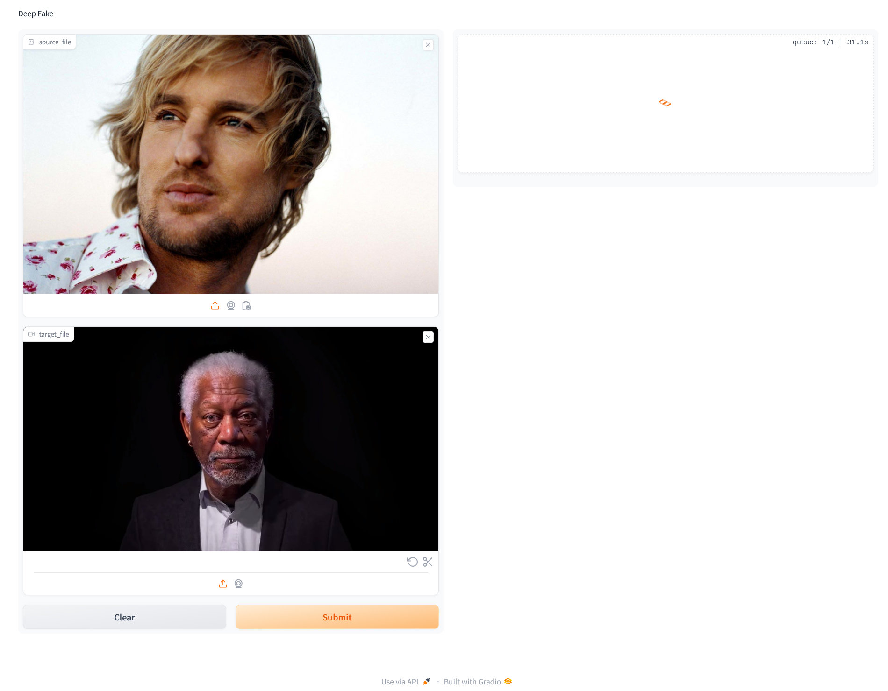
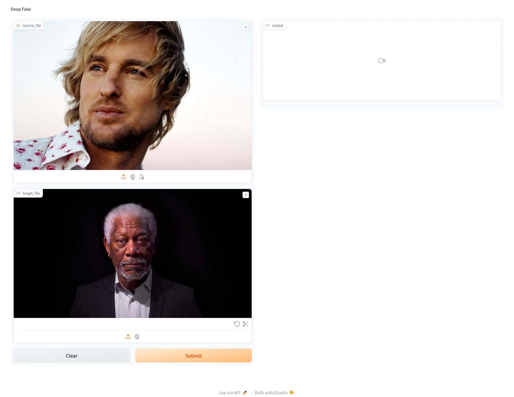

🚀Check out the configuration reference at https://huggingface.co/docs/hub/spaces-config-reference

🚀Huggingface Spaces : https://huggingface.co/spaces/prithivMLmods/Video-Face-Swapper

🚀Docs for Space : 

    # Make sure you have git-lfs installed (https://git-lfs.com)
    git lfs install
    
    git clone https://huggingface.co/spaces/prithivMLmods/Video-Face-Swapper
    
    # If you want to clone without large files - just their pointers
    
    GIT_LFS_SKIP_SMUDGE=1 git clone https://huggingface.co/spaces/prithivMLmods/Video-Face-Swapper

## 🖼️🖼️Source Image and Target Video as inputs : 

## 🔃🔃Processing Input Sources : 

## 🏵️🏵️Starts Enhancing the Model Sources

## 📤The Final Outcome :

## 📟PyPI Requirements.txt

## ⚠️⚠️⚠️ Guidelines :

    When using a video face swapper deepfake tool, it's crucial to adhere to both technical and ethical standards to avoid misuse. First, ensure your system meets the software requirements, and carefully follow installation instructions. Use high-quality video and face images, maintaining consistent lighting and angles for best results. Load your media into the tool, align and adjust settings, and preview the swap before rendering. Refine the output using editing tools to correct artifacts and enhance quality. Export the final video in the appropriate format.
    
    Ethically, always obtain explicit consent from individuals whose faces you use. Never create deceptive or misleading content, and avoid using the tool for malicious purposes like defamation or harassment. Comply with local laws and clearly label deepfake content to avoid confusion. Be respectful and sensitive, refraining from making offensive or harmful content. Use deepfake technology positively for education, entertainment, and art, and regularly review your projects to ensure they meet ethical standards. Stay informed about the latest advancements and engage with the community to learn and share best practices, ensuring your use of deepfake technology is responsible and respectful.

.

.

.
